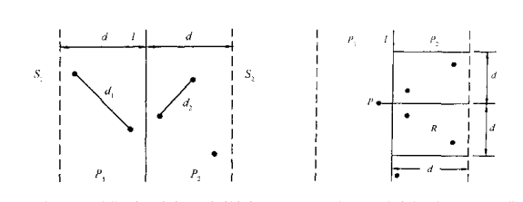
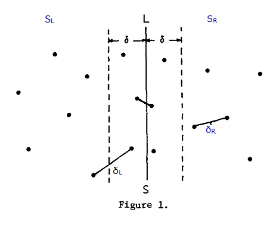
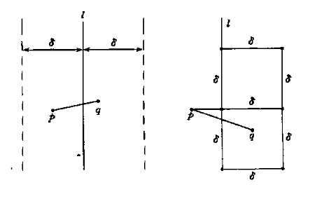

beauty_of_programming
=======================================================================================================================
1，
=======================================================================================================================

2,
=======================================================================================================================

3,一堆烙饼的排序
=======================================================================================================================
当烙饼不多的时候，我们可以很快的找出最优的翻转方案就是程序中的上界(UpperBound)，也就是说我们感兴趣的最优方案最少
也就是上面方案，那如何能找到更好的优化方案？
程序当中有个剪枝部分：
nEstimate=lowerBound(m_ReverseCakeArray,m_n)
if(step+nEstimate>m_nMaxSwap)
			return;
当m_nMaxSwap越小，剪枝条件就越容易满足,更多的情况就不用去搜索
分析：当nEstimate越大，剪枝条件就越容易满足，也就是说nEstimate越大，nMaxSwap越小，满足的条件就越小，就越容易找到最优化
解，所以在程序中必须体现尽可能减少UpperBound，增加LowerBound，从而减少要搜索的空间。
程序的上界为2*(n-1)，那么程序的下届如何估计呢：
每一次翻转，我们最多使得一个烙饼与大小相邻的烙饼排到一起。如果当前n个烙饼中，有m对相邻的烙饼半径不想了，那么我们至少需
要m次才能排好序。程序中通过遍历相邻的两个烙饼，尺寸上是否相邻来进行最小界的估计

4,买书问题（如何买书最便宜，连续买几本不同的折扣高）
=======================================================================================================================
利用动态规划解决问题，多条件递归进程处理，最后比较哪种方式的价格最低
这里把买书问题看作一个动态规划问题，状态转移方程为：
F(Y1,Y2,Y3,Y4.Y5)=0  if(Y1=Y2=Y3=Y4=Y5=0)
or F(Y1,Y2,Y3,Y4,Y5)=min{5*8*(1-25%)+F(Y1-1,Y2-1,Y3-1,Y4-1,Y5-1),
 4*8*(1-20%)+F(Y1-1,Y2-1,Y3-1,Y4-1,Y5),
 3*8*(1-10%)+F(Y1-1,Y2-1,Y3-1,Y4,Y5),
 2*8*(1-5%)+F(Y1-1,Y2-1,Y3,Y4,Y5),
 8+F(Y1-1,Y2,Y3,Y4,Y5)}

5，快速找出机器故障（找出双备份记录中仅出现一次的某个数）
=======================================================================================================================
算法核心原理：一个数和其本身的异或为0，具体情况见代码包括丢失两个记录（两个相同与两个不同）
这次代码中注释很详细，忘了的话可以看看代码

6，饮料供货（代码来自CSDN某博友ps：他的代码有点小错误）
=======================================================================================================================
在饮料总量限定的情况下，如何找到总满意度最大的一种选择，如果能列出推导公式，那么利用动态规划将很轻松就能解决

7，光影切割问题
=======================================================================================================================
光影切割部分问题能够够根据直线条数和交点数目改变成为更具比较简单的问题：
如果有N条直线，其中有M个交点，那么分块区域的数目为N+M+1
故我们只需要求N条直线M个焦点的情况，根据《编程之美》P51中图1-13所示，交点的个数就转换成了如何求一个N个元素的数组的逆序数
求逆序数时间复杂度较低的算法是采用分冶的思想，首先求N/2个元素的逆序数然后求后N/2个逆序数，最后在排序过程中合并前后两部分
的逆序数。
逆序数的求法参见这篇博文：http://blog.csdn.net/dlengong/article/details/7594919

8，电梯调度算法
=======================================================================================================================
电梯每次载满乘客后只在某一层停留，剩余的需要自己走楼梯，如何保证走楼梯的总数目最小
分析：假设有N1个乘客在i层以下，N2个乘客在i层，N3个层客在i层以上，那么假如我选择在i-1层停，那么比i层停多走的层数为N2+N3-N1
如果选择在i+1层停，那么比i层夺走的层数为N1+N2-N3。比较两者多走的大小，易知何时选择上升合适，何时选择下降合适。
代码可以从这方面着手，我们从第一层开始，得到某层以上的人数，某层所在人数，某层以上人数然后通过上述所述策略来判断是否上升
直到第一次不再上升即找到了合适的层数来保证所有人数走的层数最少。

9,高效地安排见面会
=======================================================================================================================
1，寻找可以同时召开的会议，来进一步减少花费的时间：
这个问题可以转换为图的最少着色问题：
a,将两个不能同时召开的回忆，用同一条直线进行连接
b,然后对每个顶点进行着色，保证有直线连接的两个节点不许重色

2，面试的时候，每次会面会有一个开始时间，一个结束时间，现在有一组2面试时间数据，要求每一个有冲突的时间，都不允许安排
在同一地点，求出最小需要安排的地点数目
分析:对所有面试按开始时间从小到大进行排序，然后按照顺序对各个空间着色，对当前某区间着色时，
必须保证所着的颜色没有出现在这个区域之前且时间段与当前区间有重叠的区间
一种优化算法：将所有的开始时间和结束时间共同参与艾许得到一个长度为2*N的有序数组
遍历数组，当时间类型为开始时间，则使用颜色加1，如果是结束时间，则使用颜色减1，（这里还不是弄的很明白）

10,双线程高效下载
=======================================================================================================================

11,求二进制数中1的个数
=======================================================================================================================
算法1：二进制数对2求余，如果余为0则该位上为0，为1则该位为1，然后二进制数除以2然后判断第2位直到数为0
算法2：类似于算法1但是由于求余和除以2操作相对于位操作更复杂，可以使用向右移位代替除以2，与00000001求与来判断该位是否为1
算法3：位操作相比除以和求余效率高了很多，但是时间复杂度仍为O(log2v)，那是否能够每次判断中仅与1来判断，则复杂度与1的个数有关
综上所述，我们进行v&=v-1操作，例如数为00010110&00010101=00010100，继续知道其中变为00000000，次数为其中1的个数有关。
算法4和算法5类似：都是采用空间换时间，在O(1)时间能判断出来，算法4采用分支结构，将所有分支都写出来判断，算法5采用查表法，
创建一个表，index为数，内容为1的个数，也可以在O(1)时间判断1的个数

12，不要被阶乘吓到
=======================================================================================================================
给定一个整数N，1，如何求N的阶乘N！末尾有几个0？
2，求N！的二进制表示中最低位1的位置
针对问题1，我们不可能先算法N！，因为很有可能会有溢出分析如果N！=K×10^M，且K不能被10整除，那么N！末尾有M个0，考虑对N！进行
因式分解，由于10=2×5，所以M的数目只与2和5的个数有关，M=min(X,Z)(X,Z表示因式分解中2的次数，5的次数)，易知，X肯定大于或者等于Z
故综上M=Z。
而Z的计算与11中1的个数的算法1类似。
这里我们将有另一种算法通过公式：Z=[N/5]+[N/25]+[N/5^3]...来表示N！中质因数5的个数

问题2分析即为其中含质因数2的个数同理根据公式Z=[N/2]+[N/2^2]+...既可以计算N！中质因数2的个数
另外一种算法：根据公式：N！含有质因数2的个数还等于N减去N的二进制中1的个数

13,寻找水王
========================================================================================================================
如何快速有效地在找出消息列表中发帖超过一半的那个ID？
一开始想到的办法无非是对列表进行排序，然后统计次数或者寻找第N/2个ID即为超过一半的，但是这两种办法都需要先对ID列表进行排序
有没有不进行排序的算法呢？
我们可以这样，每次删除两个不同的ID，很显然剩下的ID列表中，“水王”ID出现的次数仍然超过总数的一半，一直重复这个过程，把ID列表
内的总数降低即可以转换为更小的问题，从而得到答案

14，查找1到N中1出现的次数
=========================================================================================================================
算法描述：每一位上出现1的情况分为三类：1，该位数字为0，该位上出现1的次数由更高为决定，例如12013中百位出现1的情况为12×100=1200
2，该位数字为1不仅受高位影响还受低位影响例如12113中百位出现1的情况数目是12×100=1200，还包括12100-12113一种114个即113+1
3，如果该位上数字大于1，那么百位上可能出现1的次数由更高位决定为：（12+1）×100

15,寻找最大的k个数
=========================================================================================================================
算法1：使用快速排序或者堆排序，他们的时间复杂度都是O(N*log2N)，然后取出前K个，总时间复杂度为O(N*log2N)+O(K)=O(N*log2N)，另外
也可使用部分排序，例如选择排序，交换排序只需要把N个数中前K个数排序出来，复杂度是O(N*K)，哪一个更好，取决于K与log2N的比较。
算法2：和快速排序类似，在快速排序中，每一步都是将待排序数组分为两组，其中一组数据的人任何一个数都比另一组的任意数达，再对两组
分别做类似操作：假设N个数存储在数组S中，从数组S中随机找出一个元素X，把数组分为Sa和Sb。Sa中的元素大于等于X，Sb中的元素小于X。
故存在两个可能：a,Sa中元素的个数小于K，Sa中所有的数和Sb中最大的K-|Sa|个元素就是数组S中最大的K个数；b，Sa中元素的个数大于或等于K
，则需要返回Sa中最大的K个元素。
算法3：寻找N个数中最大的K个数，本质上就是寻找最大的K个数中最小的那个，也就是第K大的数。这里可以使用二分搜索的策略。对于一个给定的
数p，可以在O(N)的时间复杂度内找出所有不小于p的数。
算法4：上面三个算法虽然能够解决，时间复杂度增加也很正常，但是个哦南通的地方是需要对数据进行对此访问，但N足够大的时候，比如100e？
这个时候数据不能完全的装入内存，为了解决这方面的问题，可以使用最小堆的方法，最小堆容量为K，最小堆的堆顶元素就是这K个元素中最小的，
遍历N个数据，如果X比堆顶小，那么替换堆顶元素，然后更新堆来维持堆的性质，更新的过程的时间复杂度为O(log2K)。(要看书再次深刻地了解
最大堆和最小堆的关系，以及如何实现)
算法5：如果所有N个数都是正整数，且他们的取值范围不大，可以考虑申请空间，记录每个整数出现的次数，然后从大到小去最大的K个。比如所有
整数都在(0,MAXN）区间中的话，利用一个数组count[MAXN]来记录每个整数出现的个数(count[i]表示整数i在所有整数中出现的个数)。我们只需要
扫描一遍就可以得到count数组，然后找到第K大的元素。

16,最大公约数问题(大整数下)
=========================================================================================================================
算法一：采用辗转相除法，f(x,y)表示x,y的最大公约数，而最大公约数的性质有f(x,y)=f(y,x%y)，那么可以迭代直到x,y中某一数为0，即可以描述出最大的公约数。
算法二：因为算法一用到了求余运算，而对于大整数而言求余运算很复杂，有没有更简单的方法呢？
答案是明显的，我们发现f(x,y)=f(x-y,y),那么我们可以将大整数变为简单很多的减法来得到最大公约数。

算法三：算法一问题在于大整数除法计算很复杂，算法虽然将除法运算换成减法，但是减法的地带次数会增加很多，能否结合算法一和算法二从而得到一个最佳的算法呢？对于y和x来书，如果y=k*y1,x=k*x1那么f(y,x)=k*f(y,x)，如果x=p*x1假设p为素数，并且y%p!=0那么f(x,y)=f(p*x1,y)=f(x1,y)，最简单的方法：2是一个素数，并且大整数的除法和乘法运算可以换成左移和右移一位，故我们可以取p=2：
若x,y为偶数，f(x,y)=2*f(x>>1,y>>1)
x为偶数，y为奇数,则f(x,y)=f(x>>1,y)
x为奇数，y为偶数，则f(x,y)=f(x,y>>1)
x,y均为奇数，则f(x,y)=f(x,x-y)

17,斐波那契数列
==========================================================================================================================
f(n)=0 if n=0;1 if n=1; f(n-1)+f(n-2) if n>1
1,递归使用，但是系统函数调用是有限制的，不能无限递归，并且每次计算都要计算之前已经好了的数据
2，利用一个数组来存储已经计算好的数据，然后新的根据之前的两个数进行计算，这是一种递推关系式的优化
3，求通项公式，利用数学球解出f(n)的表达式，f(n)=？？？然后代入n，即可在O(1)情况下得到f(n)
4,(fn,fn-1)=(fn-1,fn-2)*A=(f1,f0)*A^n-1，其中A=[1,1;1,0]即转换为矩阵的计算而矩阵的计算可以很快的通过
分冶法计算A^n=(A^(n/2))^2,n为偶数，当为奇数时，A^n=A*(A^(n/2))^2.

18,寻找最近点对
==========================================================================================================================
算法1：数组中总共有N个数，计算其中两两之间的差值，那么就很容易计算出其中的最小值。
算法2：先对数据进行排序，如使用快排，则时间复杂度为O(Nlog2N)，然后从排好序的数据中找最小值，则只需要找相邻之间的差值即可。
但是这个算法不能推广到二维，因为距离最近的点，不能保证映射到某条直线之后紧靠着的两个点。
算法3：能够以复杂度为O(Nlog2N)解决一维和二维情况，但是算法有点小复杂还在消化中。采用的是分冶法：
为了使问题变得简单，首先考虑一维的情形，假设我们用m点将S分为S1和S2两个集合，对于所有的p(S1中的点)和q(S2中的点)，存在p<q。假设:
				d=min{|p1-p2|,|q1-q2|}

由此，S中最接近的点对或者是点对{p1,p2}和{q1,q2}或者是某个{p3,q3}
   

如果最接近点对是{q3,p3}即|p3-q3|<d，则p3和q3或者与m的距离都不超过d，且在区间(m-d,d]和(d,m+d]各自有且仅有一个点。这样，就可以在线性时间内实现合并。

在二维情形下，类似的，利用分冶法，但是难点在于如何实现线性的合并？
  
由上图可知，形成的宽为2d的带状区间，最多可能有n个点，合并时间最坏情况下为n^2。但是P1和P2中的点具有以下稀疏的性质，对于P1中任意一点，P2中的点必定落在一个d*2d的矩形中，且最多只需检查六个点（鸽巢原理）。
先将带状区间的点按y坐标排序，然后线性扫描这样合并的时间复杂度为O(nlogn)，几乎为线性。
具体步骤如下：已知集合S中有n个点，分治法的思想就是将S进行拆分，分为2部分求最近点对。算法每次选择一条垂线L，将S拆分左右两部分为SL和SR，L一般取点集S中所有点的中间点的x坐标来划分，这样可以保证SL和SR中的点数目各为n/2，（否则以其他方式划分S，有可能导致SL和SR中点数目一个为1，一个为n-1，不利于算法效率，要尽量保持树的平衡性）

依次找出这两部分中的最小点对距离：δL和δR，记SL和SR中最小点对距离δ = min（δL，δR），如下图：
   
以L为中心，δ为半径划分一个长带，最小点对还有可能存在于SL和SR的交界处，如下图2左图中的虚线带，p点和q点分别位于SL和SR的虚线范围内，在这个范围内，p点和q点之间的距离才会小于δ，最小点对计算才有意义。
  
对于SL虚框范围内的p点，在SR虚框中与p点距离小于δ的顶多只有六个点，就是图二右图中的2个正方形的6的顶点。这个可以反推证明，如果右边这2个正方形内有7个点与p点距离小于δ，例如q点，则q点与下面正方形的四个顶点距离小于δ，则和δ为SL（）和SR中的最小点对距离相矛盾。因此对于SL虚框中的p点，不需求出p点和右边虚线框内所有点距离，只需计算SR中与p点y坐标距离最近的6个点，就可以求出最近点对，节省了比较次数。
**这里还是有点不是特别理解，不强求了，之后复习再看吧**

19,快速寻找数据中两数和为某一定值的数对
=================================================================================================================================
解法一:穷举法，从数组中任意取出两个数字，计算两者之和是否为给定的数字。时间复杂度为O(N2)
解法二：对应数组中每个数字arr[i]判断Sum-arr[i]是否在数组中，这样就变通为一个查找算法。提高查找效率的方法通常是先将要查找的数组排序，然后用二分查找等方法进行查找，总的时间复杂度为O(Nlog2N)。查找方法的一种空间换时间的算法为使用hash表存储，这样能够使用常数时间查找数字，总的时间复杂度变为O(N)但是这种方法需要额外增加O(N)的hash存储空间。
解法三：假设有了这个数组的任意两个元素之和的有序数组(长为N2).那么利用二分查找法，只需要O(2log2N)就可以解决这个问题，受这个思考启发，我们可以直接对两个数字的和进行一个有序的遍历，从而降低算法的时间复杂度。
首先，对数组进行排序，时间复杂度为Nlog2N，然后令i=0,j=n-1，看arr[i]+arr[j]是否等于Sum，如果是，则结束。如果小于Sum，则i=i+1；如果大于Sum，则j=j-1.这样只需要在排好序的数组上遍历一次，就可以得到最后的结果，时间复杂度为O(N)，那么两部加上来的总的时间复杂度为O(Nlog2N)

20，求子数组中最大乘积（给定长度为N的整数数组，计算任意(N-1)个数的组合中乘积最大的一组）
=================================================================================================================================
解法一：计算(N-1)个数的组合乘积，假设第i个(0<=i<=N-1)元素排除在乘积之外，设array[]为初始数组，s[i]表示数组前i个元素的乘积，t[i]表示数组后(N-i)个元素的成绩，那么设p[i]为数组除第i个元素外，其他N-1个元素的成绩既有p[i]=s[i-1]*t[i+1]，故知需要从头到尾，和从尾至头两次即可得到数组s[]和t[]，进而可以先行时间得到p[]，总的时间复杂度为O(N)。
解法二：通过数学分析，还可以进一步减少问题的计算量。假设N个整数的乘积为P，则分为3种情况：

1. **P为0，那么数组中至少包含有一个0.假设除掉一个0之外，其他N-1个数的乘积为Q，则根据Q的政府性进行讨论：**
	* Q=0,那么说明数组中至少有两个0，那么N-1个数的乘积只能为0，返回0；
	* Q>0，返回Q，因为如果以0代替此时N-1个数中任意一个其他的数，那么N-1个数乘积为0.
	* Q<0,返回0，因为如果此时0代替N-1个数任意一个其他的数，那么N-1个数乘积为0
2. **P<0，则遍历去掉绝对值最小的负数。**
3. **P>0,则去掉最小的正数值，当数组中没有正数时，去掉绝对值最大的负数值。**

21,求数组的子数组之和的最大值
=================================================================================================================================
首先，我们明确题意：1，题目说的子数组是连续的；2，题目只需要求和，并不需要返回子数组的具体位置；3，数组的元素是整数，所以数组可能包含有正整数、零、负整数。
解法一，暴力法:记Sum[i,...,j]，然后两次遍历数组元素，遍历所有可能的Sum[i,...,j]即可，时间复杂度大概为O(N^3)但是经过一些优化可能达到O(N^2)
解法二，使用递归方法，如果将所给数组(A[0],...,A[n-1])分为长度相等的两部分(A[0],...,A[n/2-1])和(A[n/2],...,A[n-1])，分别求出这两段数组各自的最大字段和，则可能最大子段和有以下3种情况的最大值：

1. (A[0],...,A[n-1])的最大子段和与(A[0],..,A[n/2-1])的最大子段和相同；
2. (A[0],...,A[n-1])的最大子段和与(A[n/2],...,A[n-1])的最大子段和相同；
3. (A[0],...,A[n-1])的最大子段和跨过其中间两个元素A[n/2-1]到A[n/2]
若情况为1，2，那么只要找到以A[n/2-1]结尾的和最大的一段数组之和s1=(A[i],...,A[n/2-1])和以A[n/2]开始和最大的一段数组之和s2=(A[n/2],...,A[j])那么第3种情况的最大值为s1+s2=A[i]+...+A[n/2-1]+A[n/2]+...+A[j],因此只需要对原数组进行一次遍历。这是一种分冶算法，每个问题分解为规模减半的子问题，最后的时间复杂度为O(N*log2N)。

解法三，采用动态规划的方法来解决这类问题：可以将一个大问题(N个元素数组)转化为一个较小的问题(n-1个元素的数组)。股可以得到这样的递推式：
start=max{A[i],start+A[i]}
all=max{start,all},其中，start[i]表示包括A[i]的和最大的一段数组。

